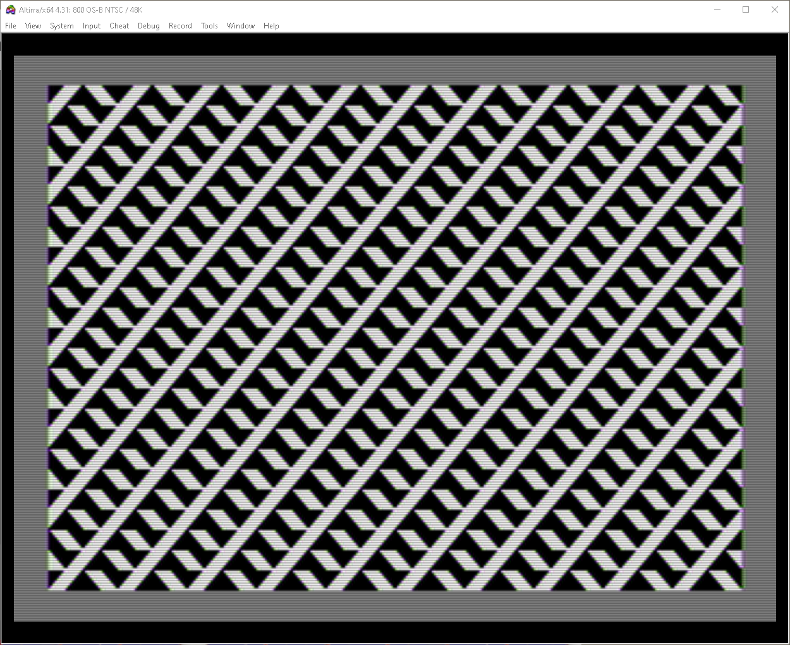

# Atari-Truchet

---

"8-bit Show And Tell" presented a video on YouTube for a tile graphics demo on the C64 based on Truchet tiles published in 1704.

The "8-bit Show And Tell" YouTube channel is here: https://www.youtube.com/@8_Bit

"8-bit Show And Tell"'s C64 video of the code walkthrough for the Truchet tiles program is here: https://www.youtube.com/watch?v=cFWNo1GjMP0

---

| **Truchet Tiles Demo - Version 00 - Direct port from C64 to Atari** |
| ------- |
|  | 

---

Version 00:  truchet00.asm

The C64 Truchet demo ported to the Atari 8-bit computers. This initial version is a direct port with as few changes possible to make the program function on the Atari the same as the C64. 
Seriously, intentionally went out of my way to make as few 
changes as possible to the 6502 assembly code except where 
necessary.

Some C64-exclusive behaviors, such as the way the machine code
is attached to a BASIC program and started with a SYS command 
naturally have to be bypassed.

The original C64 program stuffs bytes directly to screen RAM.
Since no OS printing occurs the Atari need not use any OS 
printing, either.  The Atari program can then exploit some of 
its graphics flexibility to define a custom screen using the 
same number of lines as the C64.  (Yes, the Atari can display 
25 lines of text, and more, no problem.)  In fact, we can even
have the Atari set up its custom screen using the same memory 
address as the C64.  Therefore, the screen size and writing 
code remains nearly identical.  

---

| **Truchet Tiles Demo - Version 01 - Atari-fication WORK IN PROGRESS** |
| ------- |
|  | 

---

Version 01:  truchet01.asm

Atari-fication... Adding Atari-specific features.

Code now depends on the Atari includes for sensible symbols and other goodies.   
Get them here:
https://github.com/kenjennings/Atari-Mads-Includes

---

Update 2025-08-19

* Some easy stuff first: Deleted the C64-specific work.

* Start using the include files and proper Atari symbols.

* Use an overscan screen.  In memory this is a 48 character by 30 line text display. (1440 bytes)

---

Update 2025-08-24

* Using more of the Atari system defines and (my) standard variable naming.

* Changed one-time initialization code into direct-load-from-disk behavior, eliminating that code.

* Optimizations of the pattern list to eliminate math used to reference data in structures.  (So far, this has reduced the program by about 32 bytes.)

---

To Be Continued . . . . .

---

